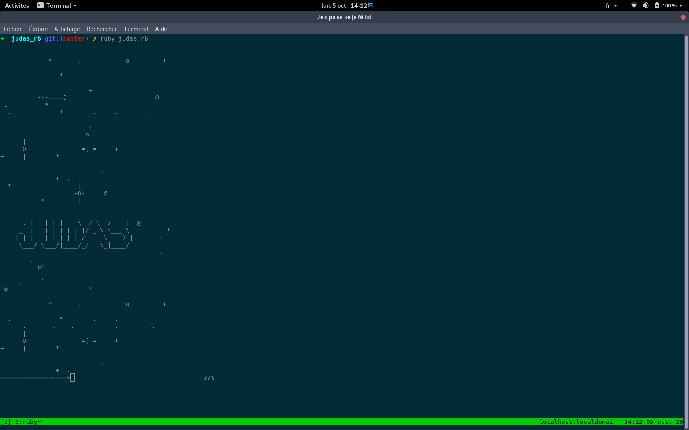
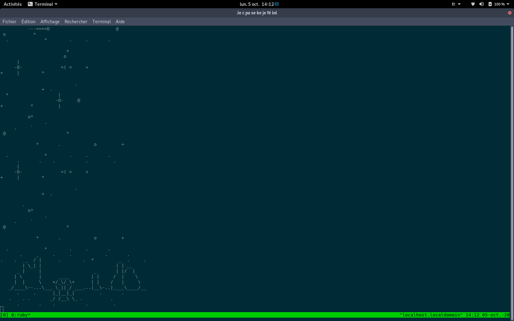
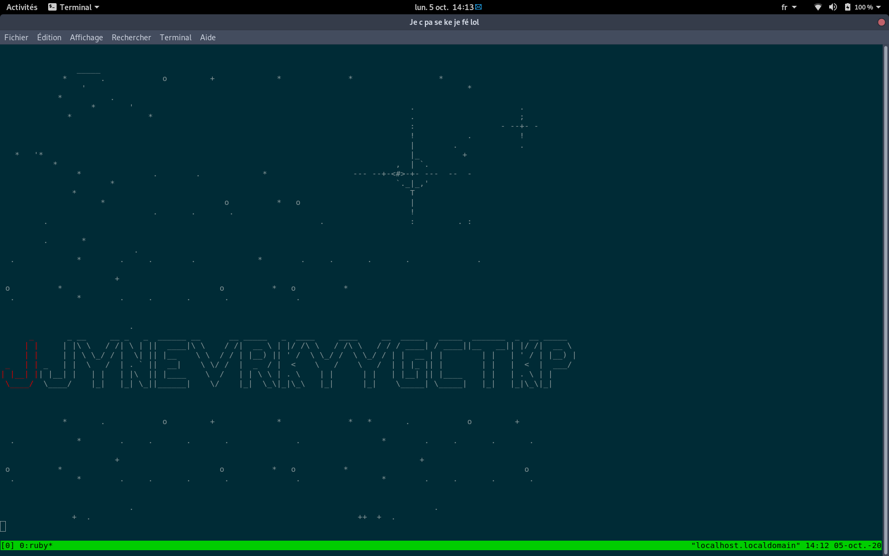
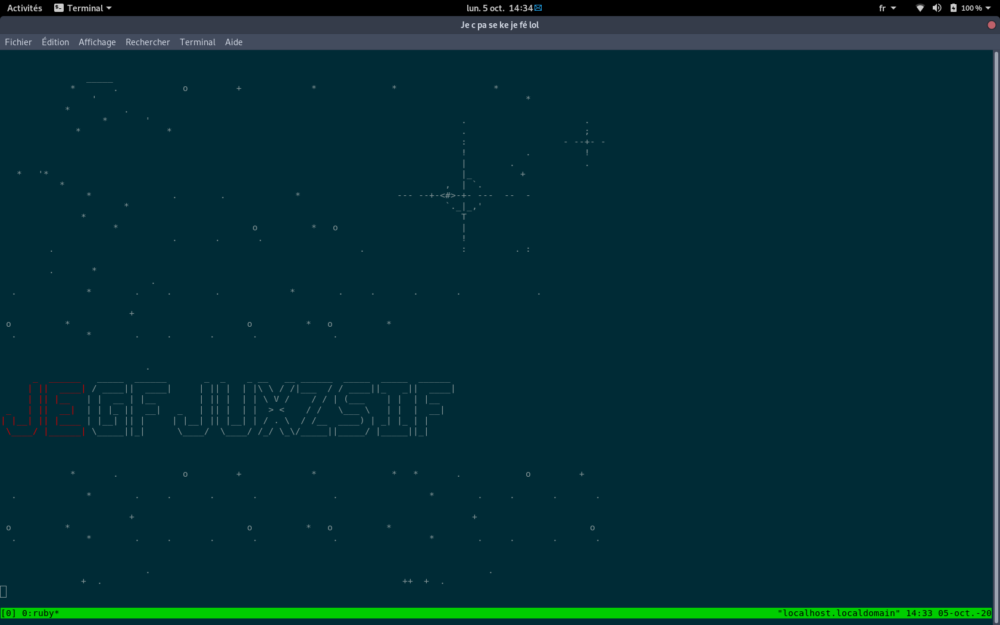
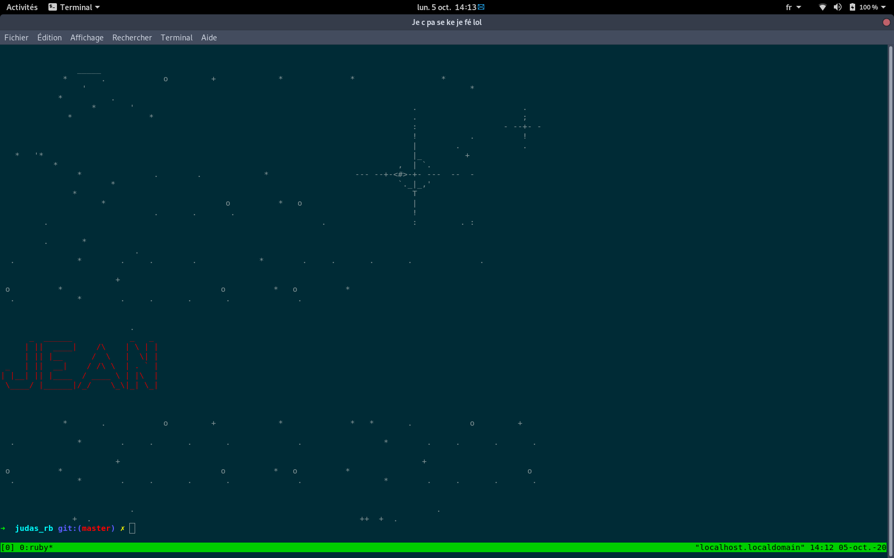

# Table of Contents

- [About the project](#judas)
	- [Usage](#usage)
- [Screenshots](#screenshots)
- [License](#license)
- [Contact](#contact)

# judas

Thursday morning, almost 9 a.m.
You're in Paris' overcrowded subway, and in a few minutes you'll have to present the tasks of the week in front of all your colleagues. You will never make it in time.
Should you accelerate the pace ? Maybe even ... run ?!
    
Of course not!


With **Judas**, you can now involve other people  into doing what you do not like to do. Just tell them you'll let fate decide who will do that thankless task.

Add everyone's name in the `condemned` file. Judas will chose one person among the list.
There is no repetition, so everyone is sure to pass only once. Fair and balanced!

Unless, of course, you remove your name from the `condemned` file.
After all, why do something when someone else can do it for you?

Also, do not forget to add multiple times the name of your least favorite colleague.

# Usage

Judas will read the names from the `condemned` file and randomly select one.
Once a name has been selected, it is written in the `.victims` file.
`.victims` is read to make sure there is no repetition, so everyone will pass once.

All names must be ASCII letters only, case does not matter.

You can launch judas using the following command:
```
ruby judas.rb
```

You can skip the introduction animation by using the following command:
```
ruby judas.rb --no-intro
```

You can reset the *memory* of the program by using:
```
ruby judas.rb --clean
```

You can achive the same effect by deleting yourself the `.victims` file:
```
rm .victims
```

You can get help using the following option:
```
$ ruby judas.rb --help
```

# Screenshots

Judas has very fancy animations.
Look! There's even a loading bar!


Terrific.


There is a lot of suspense too. It's like watching Columbo, except it is actually good.


Looks like the program's name is very fitting! Who could that be?


Or maybe not. I'm not willing totake that risk...


# License

Distributed under GPL License. See `COPYING` for more information.

# Contact

Mathias Schmitt - mathiaspeterhorst@gmail.com     
Project link: https://github.com/mphschmitt/judas
